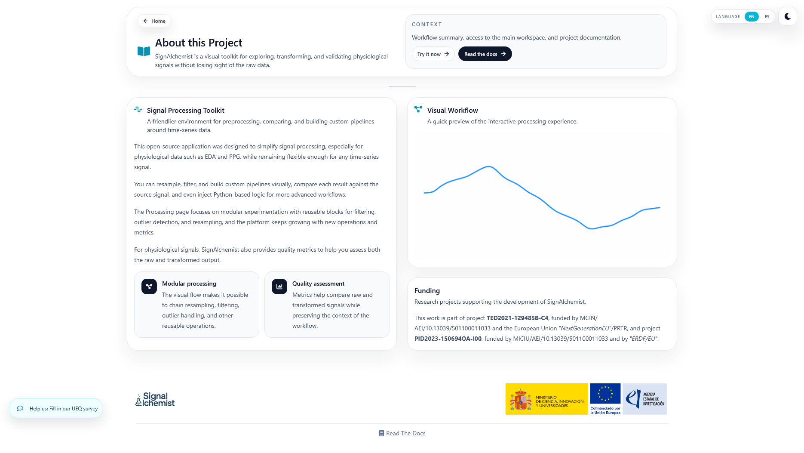

About
=====

The About page serves as a short introduction to the project.

It explains the purpose of SignAlchemist, gives a quick idea of the available workflows, and provides links back to the main application and to the documentation.

Overview
--------

This page is not a processing utility by itself. Instead, it works as a lightweight orientation page before the user moves into Home, Processing, or one of the standalone tools.

It is also a good place to briefly explain the project context, including institutional or funding information when relevant.

Main purpose
------------

The page helps position SignAlchemist for two broad kinds of use:

- Users who want direct utilities with very little setup
- Users who need reusable workflows through the Processing and Batch pages

In that sense, it works as a bridge between the project presentation and the actual signal-processing tools.

.. Screenshot: add a full-page capture of About with the hero and workflow preview.
   Suggested file: ``docs/source/_static/about-page-overview.png``.

