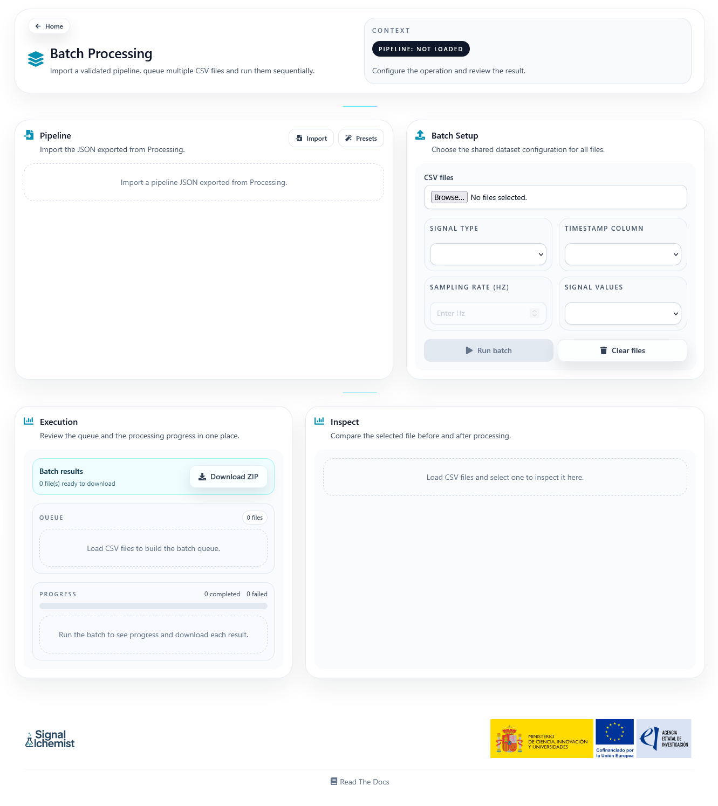
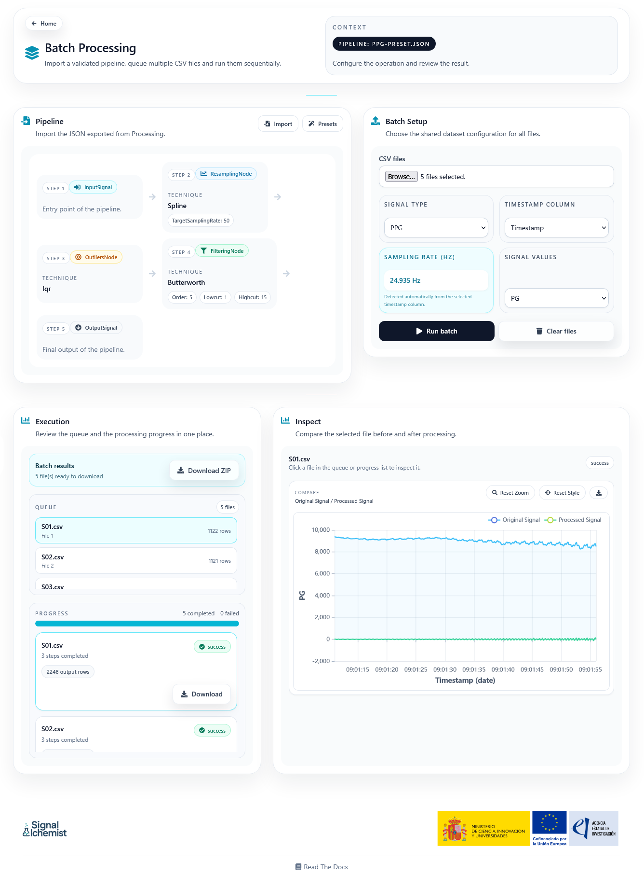

Batch Processing
================

The Batch page allows users to execute an exported Processing pipeline over multiple CSV files that share the same structure.

Overview
--------

This page is designed for situations where the same preprocessing workflow must be applied repeatedly to many recordings.

The general idea is simple:

1. Import a pipeline that has already been validated in Processing.
2. Load a group of CSV files.
3. Configure the shared dataset mapping.
4. Run the workflow over the full queue.

Page Structure
--------------

The interface is organised into three main areas:

- **Pipeline**: import a pipeline JSON or load a recommended preset
- **Batch setup**: load many CSV files and define a shared dataset mapping
- **Execution**: review queue, progress, downloadable outputs, and inspection charts

.. Screenshot: add a capture showing pipeline import, queue, progress, and the ZIP download block.
   Suggested file: ``docs/source/_static/batch-execution-overview.png``.

Pipeline Input
--------------

The page accepts the JSON exported from the Processing workspace. Once imported, the workflow summary gives a compact visual representation of the execution order.

Recommended presets can also be loaded directly from the page.

Dataset Setup
-------------

All files in the queue share the same dataset configuration:

- Signal type
- Timestamp column
- Sampling rate
- Signal values column

If the selected files do not share the same headers, the interface warns the user because batch execution assumes a common structure across the dataset.

Execution and Downloads
-----------------------

During execution, the page shows:

- The queue of loaded files
- Per-file status
- Completed and failed counters
- A ZIP download action for the processed outputs that are already ready

Each successful file can also be downloaded individually.

Inspection Panel
----------------

The inspection panel lets the user select one file from the queue and compare the original signal against the processed output.

This is useful for checking whether the exported pipeline behaves consistently across the loaded dataset.

.. Screenshot: add a second capture of the inspection panel with one completed file selected.
   Suggested file: ``docs/source/_static/batch-inspect-panel.png``.

