Core Widgets
============

This section describes common widgets or components used throughout the application.

Download
--------

The `Download` widget allows users to export the processed signal data with.

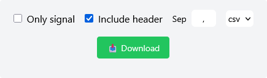

Options
~~~~~~~

- **Signal values only** (checkbox):  
  If checked, only the signal values are included (timestamps excluded).  
  *Default: Unchecked.*

- **Include header** (checkbox):  
  Adds a header row with column names.  
  *Default: Checked.*

- **Separator** (text input):  
  Custom field separator for the output file.

  Validation rules:

  - Must be a single character
  - Cannot be a dot (`.`)
  - Cannot be a number

- **File format** (dropdown):  
  Choose between `.csv` and `.txt`.

- **Download button**

Chart
-----

The `Chart` widget is a line chart that displays the signal in the time domain. The X-axis represents either:

- Datetime values (if Unix timestamps are available)
- Milliseconds from `t=0` (if timestamps were generated automatically)

The Y-axis displays the amplitude of the signal in arbitrary units.

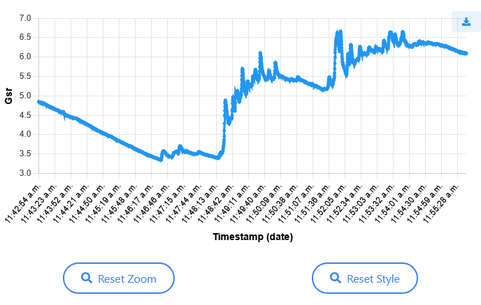

Features
~~~~~~~~

- **Tooltip**: When hovering over a point, a tooltip shows the time and value at that point.
- **Linked tooltip**: If multiple charts are present on the page with signals of equal length, the tooltip will also appear on the other chart for comparison. This is not applied if the signal lengths differ (e.g. after resampling).
- **Click interaction**: Clicking on a point zooms in and highlights it. If other chart with same signal length is present, it is also zoomed.
- **Mouse interactions**:

  - Zoom with mouse wheel
  - Pan by clicking and dragging (only X axis)

- **Control buttons**:

  - `Reset Zoom`: Restores the original zoom level
  - `Reset Style`: Removes any point highlights

- **Export**: A button is provided to export the chart as a PNG image.

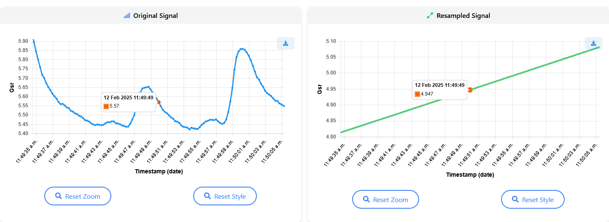

   Example of a signal chart after clicking and while hovering over a point on the original signal plot.

Spectrum Chart
--------------

The `Spectrum Chart` displays the **frequency-domain** of the signal.

The X-axis shows frequencies (in Hz), and the Y-axis shows the corresponding amplitudes, obtained from a **Fourier Transform**.

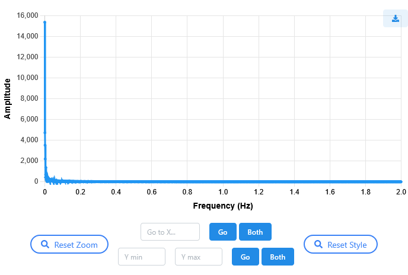

Features
~~~~~~~~

- **Tooltip**: Displays the frequency and amplitude at the hovered point. This tooltip is **not** synchronized with other charts.
- **Mouse interactions**:

  - Zoom with the mouse wheel
  - Pan by clicking and dragging (only X axis)

- **Reset Zoom**: Resets the zoom level
- **Reset Style**: Clears any custom styling or range selection

- **Go to X**: Input field and buttons:

  - `Go`: Zooms to the specified frequency value
  - `Both`: Applies the same zoom to the other chart if present

- **Y Min / Y Max**: Allows specifying a Y-axis range

  - `Go`: Zooms to the specified Y-range, fading out the signal outside this range
  - `Both`: Applies the same Y-range filtering to the other chart if present

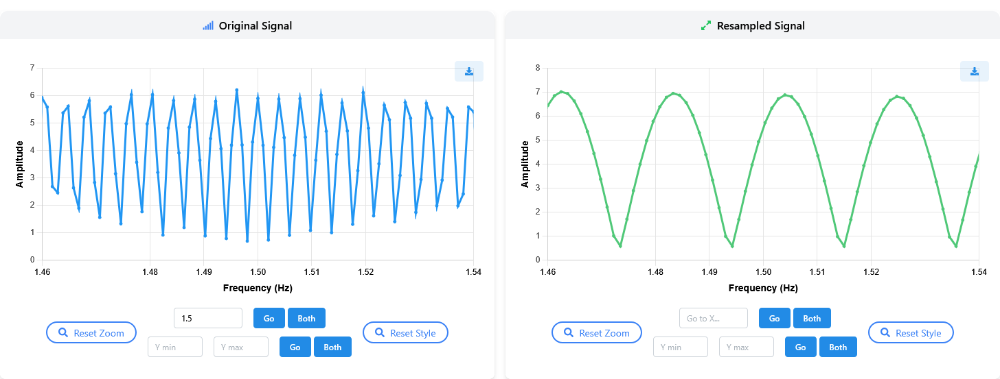

   Example of an spectrum chart after going to X on both charts.

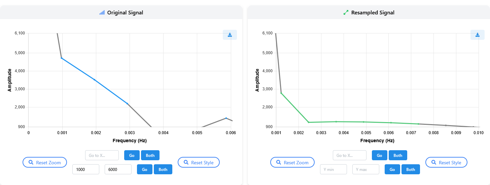

   Example of an spectrum chart after going to Y range on both charts.

Comparison Charts
-----------------

Signal Comparison
~~~~~~~~~~~~~~~~~~~~~~

The **signal** comparison chart consists of overlaying the original and the processed signals on a single `Chart`, sharing the same X and Y axes.

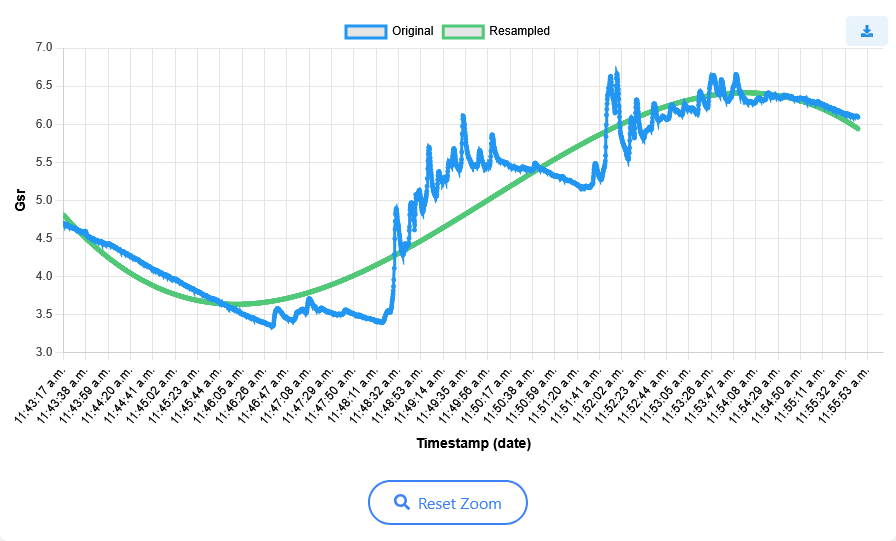

Features
^^^^^^^^

- **Mouse interactions**:

  - Zoom with the mouse wheel
  - Pan by clicking and dragging (only X axis)

- **Reset Zoom**: Resets the zoom level
- **Legend**: It is recommended to use the legend to show or hide each signal by clicking on its name.

Frequency Comparison
~~~~~~~~~~~~~~~~~~~~~~~~~~~

The **frequency** comparison chart overlays the **frequency-domain** of the original and the processed signals.

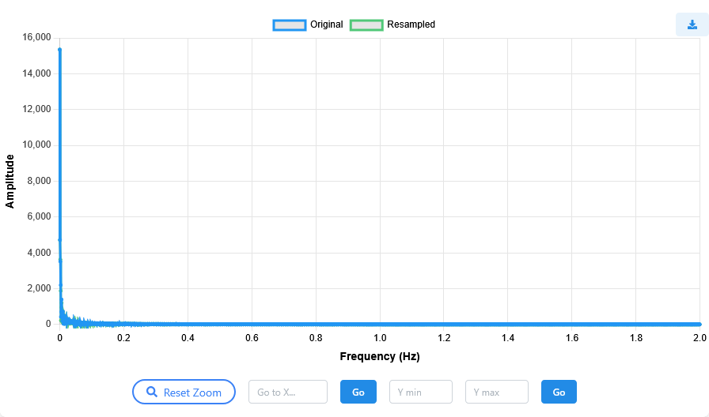

Features
^^^^^^^^
- **Mouse interactions**:

  - Zoom with the mouse wheel
  - Pan by clicking and dragging (only X axis)

- **Reset Zoom**: Resets the zoom level

- **Go to X**: Input field and button:

  - `Go`: Zooms to the specified frequency value

- **Y Min / Y Max**: Allows specifying a Y-axis range

  - `Go`: Zooms to the specified Y-range, fading out the signal outside this range
  
- **Legend**: It is recommended to use the legend to show or hide each signal by clicking on its name.

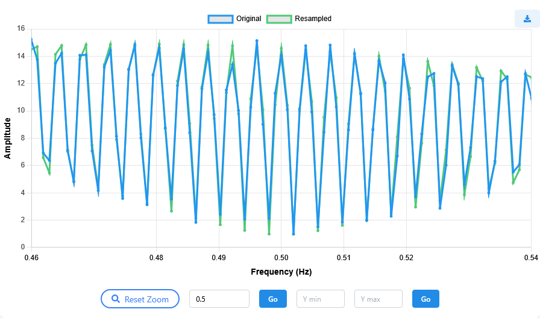

   Example of an spectrum chart after going to X.

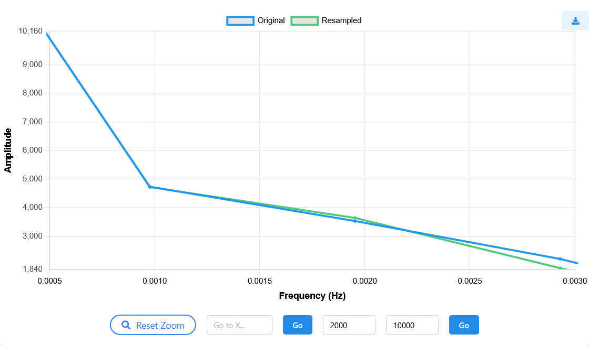

   Example of an spectrum chart after going to Y range.

Metrics
-------

The `Metrics` component displays several computed values for the signal, each presented as an individual card. These metrics are only available for **EDA** and **PPG** signal types.

Each card represents a single scientific metric, extracted from signal processing literature.

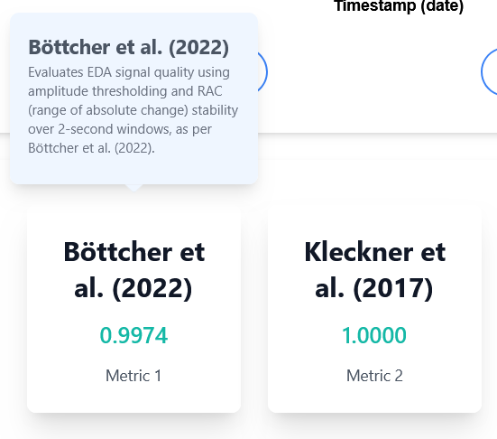

Features
~~~~~~~~

- **Scientific reference**: Each metric includes a citation to the original publication where it was proposed.
- **Interactive cards**: Clicking on a metric card opens a small popover containing an intuition about how the metric works.
