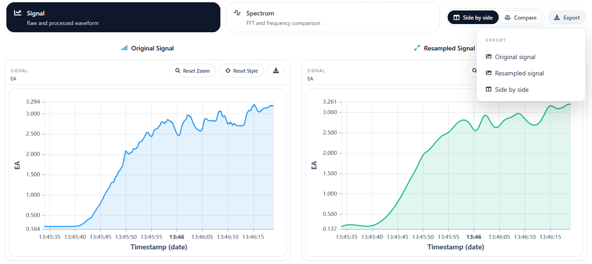
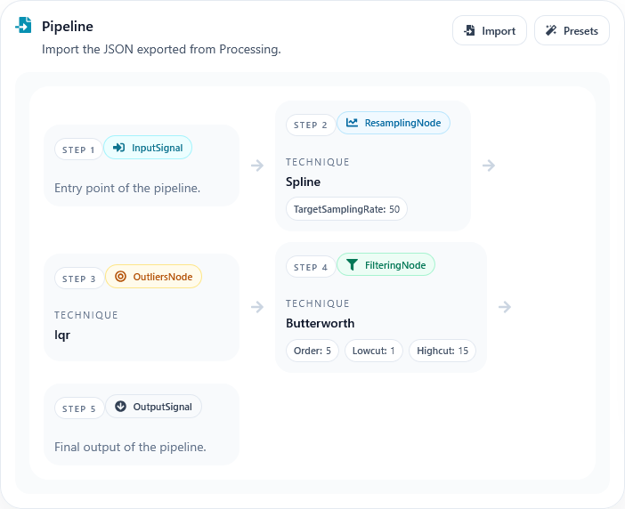

Core Widgets
============

Several interface components appear across multiple pages in SignAlchemist. This section summarises those shared elements so they do not need to be repeated in every page-specific chapter.

Signal and Spectrum Views
-------------------------

Many pages use the same result area to inspect original and processed data.

This area usually includes:

- **Signal view** for waveform inspection
- **Spectrum view** for frequency-domain inspection
- **Side by side** and **Compare** modes for layout changes

When both original and processed data are available, the export menu can generate PNG captures of each panel or a combined side-by-side export.

.. Screenshot: add one capture of the signal/spectrum area with the export menu open.
   Suggested file: ``docs/source/_static/widgets-signal-tabs-export.png``.

Charts
------

The chart widgets support the most common interactions expected during exploratory work:

- Hover tooltips
- Zoom and pan
- Reset actions
- Linked behaviour where appropriate

SignAlchemist includes dedicated widgets for single-signal charts, single-signal spectra, signal comparison charts, and spectrum comparison charts.

Metrics
-------

The metrics panel appears when the selected signal type provides quality indicators, mainly for EDA and PPG.

Each metric card can provide:

- A short label
- A brief interpretation
- Raw and processed values when comparison is available

Signal Summary
--------------

Several pages also include a compact summary of the loaded signal, usually showing:

- Duration
- Sampling rate
- Number of samples

This helps the user confirm that the correct dataset is being analysed.

Pipeline Steps
--------------

Batch uses a pipeline summary widget to visualise the imported workflow at a glance.

This is especially useful when:

- Reviewing an imported JSON pipeline
- Confirming the order of operations before execution
- Explaining a workflow to another user

.. Screenshot: add a compact capture of the pipeline steps component with at least three nodes.
   Suggested file: ``docs/source/_static/widgets-pipeline-steps.png``.

