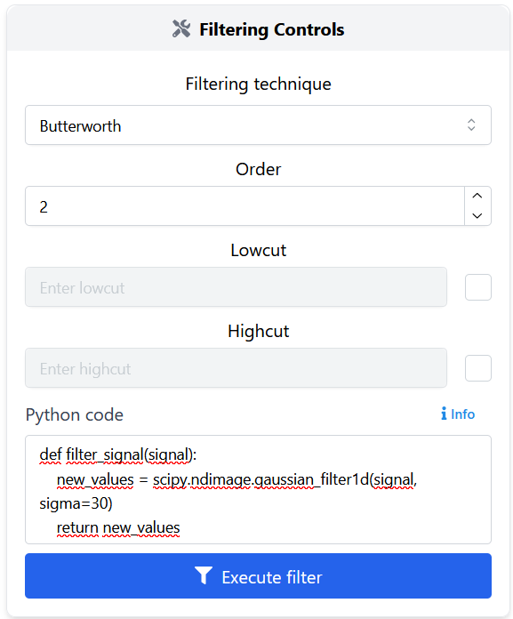
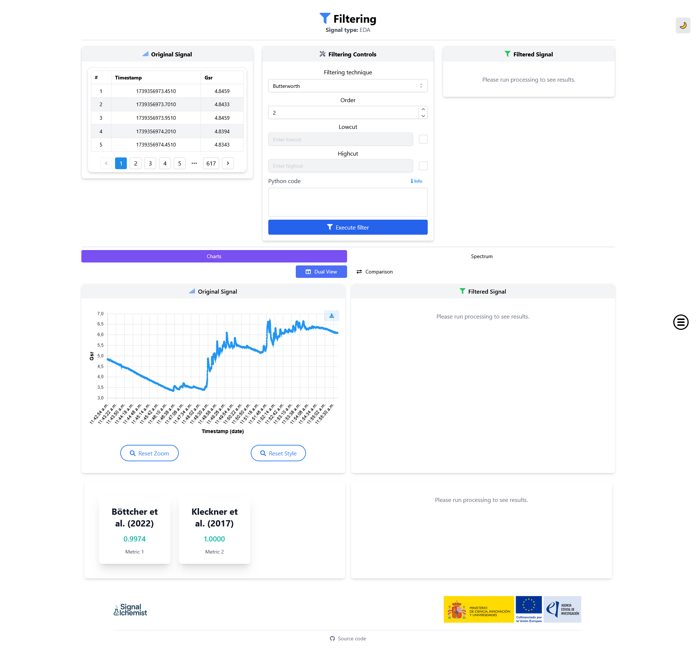

Filtering
=========

Filtering is a fundamental step in signal preprocessing, especially for cleaning and enhancing physiological data such as photoplethysmogram (PPG) and electrodermal activity (EDA).

Overview
--------

The filtering module enables users to apply a variety of signal filters with full configurability. It offers **several predefined filters** —including widely used digital filtering techniques that can be easily configured through intuitive UI controls— as well as support for **custom Python code** for more advanced use cases.

Built-in filters
----------------

You can select from several built-in filters via a dropdown:

**Butterworth Filter**
~~~~~~~~~~~~~~~~~~~~~~

The `Butterworth filter <https://en.wikipedia.org/wiki/Butterworth_filter>`_ is a classic IIR (Infinite Impulse Response) filter known for having a maximally flat frequency response in the passband. This ensures minimal distortion of amplitude in the preserved frequency range.

- *Type*: IIR
- *Phase response*: Non-linear
- *Applications*: Ideal for general-purpose filtering when amplitude preservation is critical and phase delay is acceptable.
- *Properties*: Smooth roll-off, configurable low-pass/high-pass/band-pass

**Bessel Filter**
~~~~~~~~~~~~~~~~~

The `Bessel filter <https://en.wikipedia.org/wiki/Bessel_filter>`_ is designed to maintain the wave shape of signals in the time domain, making it valuable in applications that require minimal phase distortion.

- *Type*: IIR
- *Phase response*: Nearly linear
- *Applications*: Signals linke EDA where timing of features must be preserved
- *Properties*: Gentle roll-off, excellent waveform fidelity, slower transition band

**FIR (Finite Impulse Response) Filter**
~~~~~~~~~~~~~~~~~~~~~~~~~~~~~~~~~~~~~~~~

`FIR filters <https://en.wikipedia.org/wiki/Finite_impulse_response>`_  are known for their inherent stability and linear phase behaviour. They are non-recursive and rely on a finite number of input samples.

- *Type*: FIR (non-recursive)
- *Phase response*: Linear
- *Applications*: Situations requiring phase preservation (e.g., feature alignment across channels)
- *Properties*: Very stable, supports high-order designs, ideal for multirate systems

**Savitzky-Golay Filter**
~~~~~~~~~~~~~~~~~~~~~~~~~

Unlike traditional frequency-based filters, the `Savitzky-Golay filter <https://en.wikipedia.org/wiki/Savitzky–Golay_filter>`_ smooths data by fitting successive subsets with low-degree polynomials using linear least squares.

- *Type*: Smoothing filter
- *Applications*: Peak preservation in PPG, EDA, and spectroscopic signals
- *Properties*: Retains sharp features, excellent for denoising without destroying high-frequency events

Custom filters
--------------

Advanced users can define their own filtering logic in Python.  
To do this:

1. Select the «Python code» option inside the filtering node.
2. Paste your function following this format:

    .. code-block:: python

      def filter_signal(signal): 
            new_values = scipy.ndimage.gaussian_filter1d(signal, sigma=30) 
            return new_values

    - Make sure the code is well written, with correct tabulations and blank spaces.
    - The function must be named `filter_signal`.
    - The input must be a **single** parameter that represents the signal values. 
    - The output must be a filtered array with the **same shape**.
    - If there is a **syntax error** in the code, an error message will be displayed.
    - If the field is **left blank**, the filter will be executed with the other parameters from the form (this field will be ignored).

Interface controls
------------------

- **Filtering technique**: dropdown menu to choose the method.
- **Parameters**: input fields to specify frequency cutoffs (determines the frequency threshold) and filter order (controls the steepness of the transition band).
- **Execute filter**: applies the filter and updates the results displayed in the interface.
- **Core widgets**: the results are displayed using core widgets, more specifically, charts and spectrum widgets. For more details, refer to the
  :doc:`Core Widgets <core_widgets>`.

Applications examples
---------------------

- Denoising PPG signals to remove motion artifacts.
- Extracting low-frequency trends in EDA.

