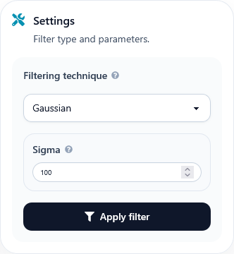
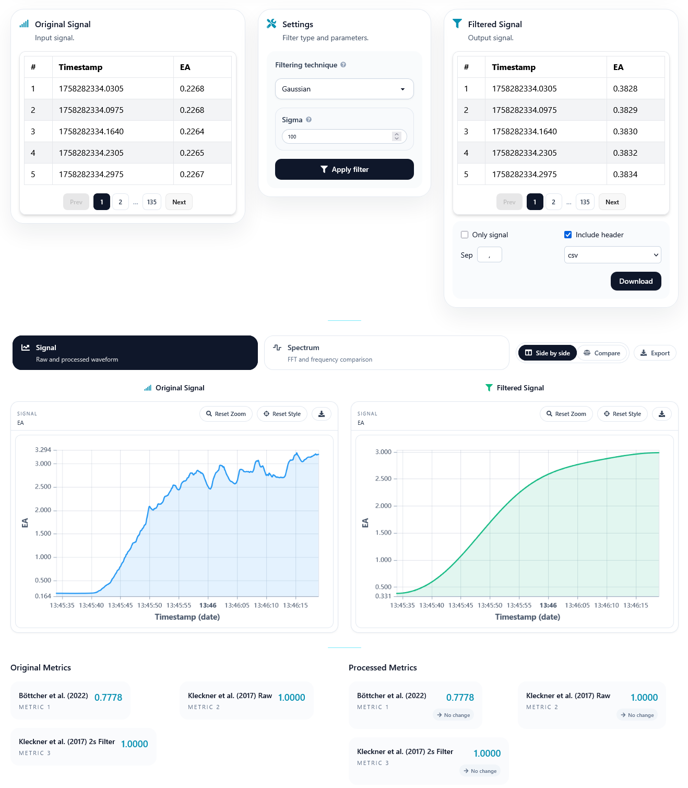

Filtering
=========

Filtering is one of the most common preprocessing operations in physiological signal analysis. It is especially useful for reducing noise and isolating the frequency ranges of interest in signals such as PPG or EDA.

Overview
--------

The Filtering page allows users to apply predefined filters through a graphical interface, while still leaving room for more advanced configurations when needed.

It supports both standard digital filtering techniques and a Python-based mode for users who want to define their own filtering function.

Built-in filters
----------------

Several built-in filters are available from the dropdown menu:

**Butterworth Filter**
~~~~~~~~~~~~~~~~~~~~~~

The `Butterworth filter <https://en.wikipedia.org/wiki/Butterworth_filter>`_ is a classic IIR (Infinite Impulse Response) filter known for having a maximally flat frequency response in the passband.

- *Type*: IIR
- *Phase response*: Non-linear
- *Applications*: useful for general-purpose filtering when amplitude preservation is important
- *Properties*: smooth roll-off, configurable low-pass, high-pass, and band-pass variants

**Bessel Filter**
~~~~~~~~~~~~~~~~~

The `Bessel filter <https://en.wikipedia.org/wiki/Bessel_filter>`_ is designed to preserve waveform shape in the time domain, which makes it useful when phase distortion should be kept low.

- *Type*: IIR
- *Phase response*: Nearly linear
- *Applications*: signals where feature timing matters
- *Properties*: gentle roll-off and good waveform fidelity

**FIR (Finite Impulse Response) Filter**
~~~~~~~~~~~~~~~~~~~~~~~~~~~~~~~~~~~~~~~~

`FIR filters <https://en.wikipedia.org/wiki/Finite_impulse_response>`_ are stable and well suited to cases where linear phase behaviour is desired.

- *Type*: FIR
- *Phase response*: Linear
- *Applications*: situations where phase preservation is important
- *Properties*: stable behaviour and support for high-order designs

**Savitzky-Golay Filter**
~~~~~~~~~~~~~~~~~~~~~~~~~

The `Savitzky-Golay filter <https://en.wikipedia.org/wiki/Savitzky%E2%80%93Golay_filter>`_ smooths data by fitting successive subsets with low-degree polynomials.

- *Type*: Smoothing filter
- *Applications*: denoising while preserving local features
- *Properties*: useful when sharp events or peaks should not be overly flattened

**Gaussian Filter**
~~~~~~~~~~~~~~~~~~~

The Gaussian filter performs smoothing based on a Gaussian kernel and is useful for soft denoising operations.

- *Type*: Smoothing filter
- *Applications*: quick removal of small fluctuations
- *Properties*: controlled through the sigma parameter

Custom filters
--------------

Advanced users can also define their own filtering logic in Python.

To do this:

1. Select the Python code option.
2. Paste a function following this format:

   .. code-block:: python

      def filter_signal(signal):
          new_values = scipy.ndimage.gaussian_filter1d(signal, sigma=30)
          return new_values

   - Make sure the code is well written, with correct indentation.
   - The function must be named ``filter_signal``.
   - The input must be a single parameter that represents the signal values.
   - The output must be a filtered array with the same shape.
   - If there is a syntax error, an error message will be displayed.

This option is intended for users who need custom behaviour not covered by the predefined filters.

.. Screenshot: add a capture of the filtering settings card with one filter selected.
   Suggested file: ``docs/source/_static/filtering-settings-card.png``.

Interface controls
------------------

- **Filtering technique**: dropdown menu to choose the method.
- **Parameters**: input fields to specify cutoffs, order, or other method-specific values.
- **Execute filter**: applies the filter and updates the results displayed in the interface.
- **Core widgets**: the results are displayed using shared charts and spectrum widgets. For more details, refer to :doc:`Core Widgets <core_widgets>`.

After execution, the page shows the processed result together with the usual comparison widgets.

.. Screenshot: add a second capture showing the filtering result and comparison area.
   Suggested file: ``docs/source/_static/filtering-results-view.png``.

Applications examples
---------------------

- Denoising PPG signals to reduce motion artefacts.
- Extracting slow-varying components in EDA.
