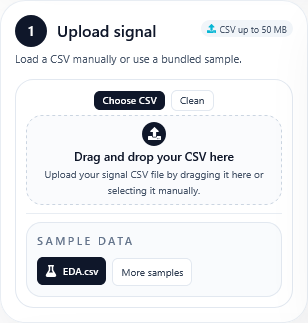
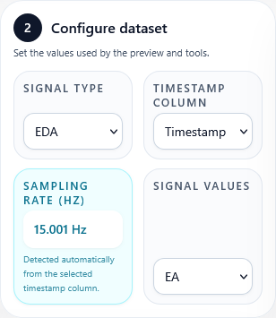
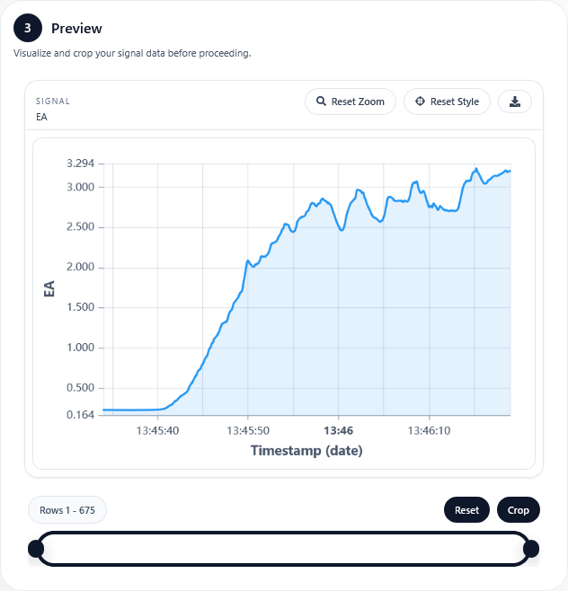
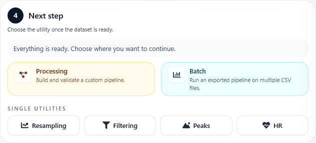

Home
====

Once the application is opened, the Home page is the starting point for almost every workflow.

This page is used to upload a CSV file, indicate how the signal should be interpreted, preview the data, and decide which utility to open next.

Overview
--------

The page is structured around a simple sequence:

1. Load a CSV file, either from your own machine or from the sample signals included in the app.
2. Configure the signal fields so the application knows which columns contain time and values.
3. Inspect the preview and crop the signal if necessary.
4. Continue to a specific utility or to the Processing workspace.

Upload Area
-----------

The upload area supports both drag-and-drop and manual file selection. There are also sample files available for users who simply want to test the application without preparing their own data first.

After the file is loaded:

- The CSV headers become available in the configuration controls.
- A table with the loaded rows is shown so the file structure can be checked.
- The following steps remain disabled until the minimum required fields are set correctly.

.. Screenshot: add a capture of the upload card before loading a file.
   Suggested file: ``docs/source/_static/home-upload-card.png``.

Dataset Configuration
---------------------

Once the file is present, the configuration card is used to tell SignAlchemist how to interpret the selected columns.

- **Signal type**: identifies whether the signal is EDA, PPG, or another type.
- **Timestamp column**: specifies which column contains the timestamps. If the file has no timestamps, that option can be indicated explicitly.
- **Sampling rate**: required when timestamps are not available. If timestamps are present, the application can estimate the effective sampling rate automatically.
- **Signal values**: selects the column containing the signal amplitude values.

This step is important because the rest of the application depends on this mapping to perform calculations correctly.

Preview and Crop
----------------

After the required fields are valid, the page displays a preview of the signal.

This section allows the user to:

- Inspect the waveform visually.
- Review the selected rows in tabular form.
- Crop the signal to a smaller segment before moving to the next utility.

Cropping is especially useful when only a stable or relevant segment of the recording should be processed.

.. Screenshot: add a capture with the configuration card and signal preview after loading a CSV.
   Suggested file: ``docs/source/_static/home-config-and-preview.png``.

Next Step Panel
---------------

The final part of the page helps the user move to the desired workflow once the dataset is ready.

From here it is possible to open:

- **Processing**, to build a reusable node-based pipeline.
- **Batch**, to run an exported pipeline over multiple files.
- **Resampling**, for direct sampling-rate conversion.
- **Filtering**, for a single filtering workflow.
- **Peak Detection**, to locate peaks in the selected signal.
- **Heart Rate**, to estimate heart rate from PPG data.

.. Screenshot: add a capture of the next-step area once the dataset is valid.
   Suggested file: ``docs/source/_static/home-next-step.png``.

