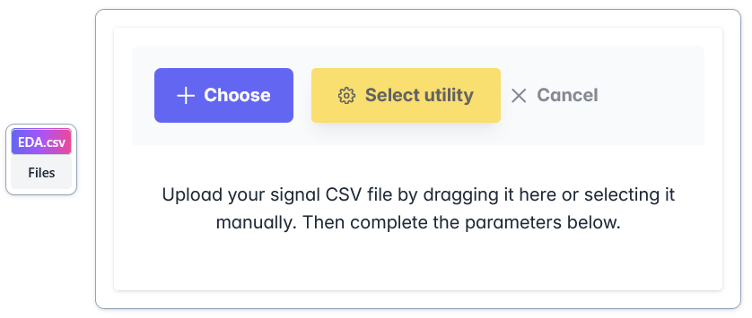

Home
====

Once accessed the deployment URL, it will display, and without registration required, the page to upload a csv file.

This page is structured in two parts.

Firstly, there is a drag and drop box to upload the file, it can also be done in the traditional way by clicking on the "Choose" button, which will display a file system window.

For those who just want to test the application, there is a small button and a drop-down menu on the left to download two sample signals.

Once the files have been loaded, a table with all the contents of the csv file will be displayed at the very bottom. 

This will help the user to fill in the following fields:

- **Signal type**: Type of physiological signal. For EDA and PPG, SignAlchemist measures quality metrics for those signals.

- **Timestamp columns**: To indicate which column of the csv contains the signal timestamps (SECONDS required). If this column is not available, it should be indicated as "No timestamps". In this way, SignAlchemist will generate some artificial timestamps starting at 0s using the next field, Sampling rate.

- **Sampling rate (Hz)**: Integer. If the timestamps are unknown, this parameter will be enabled. SignAlchemist cannot generate timestamps without knowing how many signal values were taken per second. Otherwise, SignAlchemist will automatically calculate these value based on the timestamps that are known.

- **Signal values**: To indicate which csv column contain the signal values (undefined unit).

**Note:** In case of knowing both timestamps and sampling rate, it is recommended to indicate the sampling rate manually. The automatic sampling rate calculation process could be altered by lack of precision or missing data.

Finally, the signal can be cropped through an slider. The table will reflect this trim.

Once the fields have been filled in, a graph of the signal will be displayed on the right side so the user can confirm whether the parameters are correct and make sense.

The last step is to click on "Select utility" to open a popup window to select the desired functionality.

