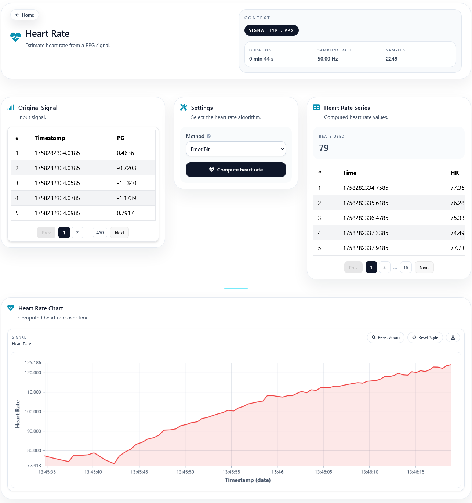

Heart Rate
==========

The Heart Rate page estimates heart rate from a PPG signal.

Scope
-----

This utility is only meaningful for PPG inputs. When the loaded dataset is not PPG, the interface warns the user accordingly.

Methods
-------

The current interface provides two methods:

- **EmotiBit**
- **NeuroKit**

These methods can be selected from the settings card and executed against the loaded signal segment.

Outputs
-------

After a successful request, the page shows:

- A heart-rate time series chart
- A tabular representation of the computed values
- The number of beats used by the algorithm

This page is useful both as a direct utility and as a reference for the corresponding heart-rate node in the Processing workspace.

.. Screenshot: add a capture of the page after a successful PPG run.
   Suggested file: ``docs/source/_static/hr-page-output.png``.

