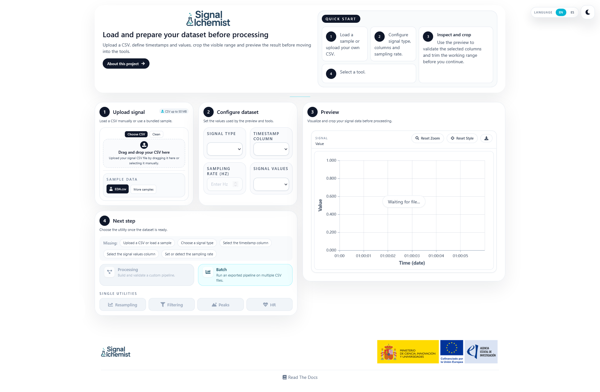

.. image:: _static/logo.png
   :alt: SignAlchemist logo
   :width: 200px
   :align: center

Welcome to SignAlchemist!
=========================

SignAlchemist is an open-source web application for loading, inspecting, transforming, and validating physiological signals directly in the browser.

Its purpose is to make signal processing easier for both novice and advanced users. For simple workflows, the application provides direct utilities such as resampling, filtering, peak detection, and heart-rate estimation. For more advanced cases, it also includes a node-based processing workspace and batch execution tools.

The application has been designed as a web-based interface, so it can be used from any modern browser without requiring a local Python workflow from the user.

Features
--------

- **Home page**: load a CSV file, define timestamps and signal values, preview the recording, and choose the next utility.
- **Processing workspace**: create reusable preprocessing pipelines visually by connecting nodes.
- **Batch execution**: run an exported pipeline over multiple files that share the same structure.
- **Standalone tools**: use focused pages for resampling, filtering, peak detection, and heart-rate estimation.
- **Shared visual widgets**: inspect raw and processed signals using charts, spectra, summaries, and comparison views.

Contents
--------

The documentation is organised around the main parts of the application:

- :doc:`installation` explains how to run the project and how the documentation is bundled into the frontend.
- :doc:`usage` describes how to access the app and move around the main interface.
- :doc:`home` covers dataset loading and initial validation.
- :doc:`processing` and :doc:`batch` describe the reusable workflow features.
- :doc:`resampling`, :doc:`filtering`, :doc:`peaks`, and :doc:`hr` describe the direct analysis utilities.
- :doc:`core_widgets` summarises the shared visual components that appear across multiple pages.

.. Screenshot: add an updated landing or home capture near the introduction if needed.
   Suggested file: ``docs/source/_static/index-home-overview.png``.

.. toctree::
   :maxdepth: 2
   :caption: Contents:

   about
   home
   processing
   batch
   resampling
   filtering
   peaks
   hr
   core_widgets
   installation
   usage
