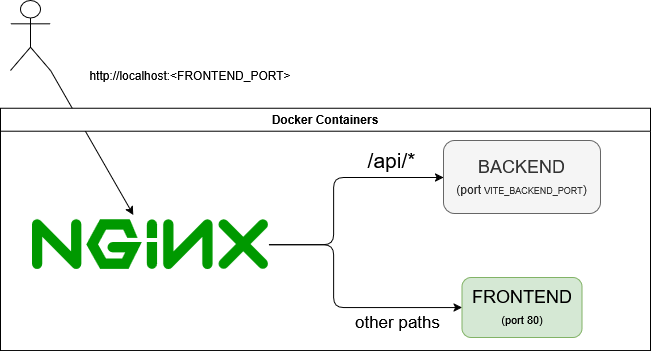

Installation
============

**SignAlchemist** uses Docker containers to simplify the installation and deployment process.

Environment Variables
------------------------

Edit the environment variables file with:

.. code-block:: bash

   nano .env

Example configuration:

.. code-block:: none

   VITE_BACKEND_PORT=     # Port where the backend server will run
   FRONTEND_PORT=         # Port where the frontend will be accessible
   PYTHON_ENABLED=        # Enable Python scripting support (true/false)

Three environment files are used depending on the context:

- **.env**: Default. Used only when neither `.env.dev` nor `.env.prod` are provided.
- **.env.dev**: Used for the development build.
- **.env.prod**: Used for the production build (Python scripting disabled).

Development Mode
-------------------

To start the application in **development mode**, run:

.. code-block:: bash

   docker compose -f docker-compose.dev.yml --env-file .env.dev up --build

This will:

- Build and run the containers in development configuration.
- Use the settings from `.env.dev`.

**Important:** Don't forget the `--env-file` flag to load the correct environment variables.

Once the containers are running, you don't need to do anything else to access the application and its API — both will be available on the ports specified in the environment variables.

It’s also important to note that these ports are not only used in the `docker-compose.yml` files but also in the `vite.config.js` configuration:

.. code-block:: javascript

   server: {
     watch: {
       usePolling: true,
     },
     host: true,
     strictPort: true,
     port: parseInt(process.env.FRONTEND_PORT || '5173'),
     proxy: {
       '/api': {
         target: `http://backend:${process.env.VITE_BACKEND_PORT || '8000'}`,
         changeOrigin: true,
         rewrite: path => path.replace(/^\/api/, ''),
       },
     },
   }

The **proxy** section is essential during development. It ensures that any request to `/api` from the frontend is forwarded to the backend container. 
The `rewrite` function strips the `/api` prefix from the URL path before forwarding the request to the backend.

Production Mode
------------------

To launch the application in **production mode**, use:

.. code-block:: bash

   docker compose -f docker-compose.prod.yml --env-file .env.prod up --build -d

This will:

- Run the app in detached mode (`-d`)
- Use `.env.prod` as the configuration

**Note:** In production mode, Python scripting must be disabled for security reasons.

Production Architecture
~~~~~~~~~~~~~~~~~~~~~~~~~~~~~~~~

In production, the application is composed of three containers:

1. **backend** – Runs the Python API using Uvicorn.
2. **frontend** – Serves the built static frontend files.
3. **nginx** – Acts as the single public entrypoint, routing all incoming traffic.

Port Behavior
~~~~~~~~~~~~~~~~~~~~~~~~~~~~~~~~

- ``VITE_BACKEND_PORT`` specifies the **internal port** used by the backend container.  
- ``FRONTEND_PORT`` is the **host port** that maps to Nginx — this is the only port exposed to the outside world.
- The **frontend container** listens on port `80` internally and is only accessed by Nginx.

So, when a user accesses the application via http://localhost:<FRONTEND_PORT> (whatever domain/IP), the request is actually handled by the Nginx container.

Nginx Routing Logic
~~~~~~~~~~~~~~~~~~~~~~~~~~~~~~~~

Nginx forwards requests based on their path:

.. code-block:: nginx

   server {
       listen 80;

       location /api/ {
           proxy_pass http://backend:8000/;
           proxy_http_version 1.1;
           proxy_set_header Upgrade $http_upgrade;
           proxy_set_header Connection 'upgrade';
           proxy_set_header Host $host;
           proxy_cache_bypass $http_upgrade;
       }

       location / {
           proxy_pass http://frontend:80;
       }
   }

- Requests to `/api/` are forwarded to the backend container.
- All other requests (such as ``/about`` or ``/filtering``) are routed to the frontend container.

.. important::

   The value in `proxy_pass http://backend:8000/;` must match the backend port (`VITE_BACKEND_PORT`) defined in `.env.prod`.  
   If you change `VITE_BACKEND_PORT`, **you must update this Nginx config manually**.

It is up to the user to set up an additional reverse proxy on the host machine if needed. For example, route `example.com` to its `localhost:<FRONTEND_PORT>`.