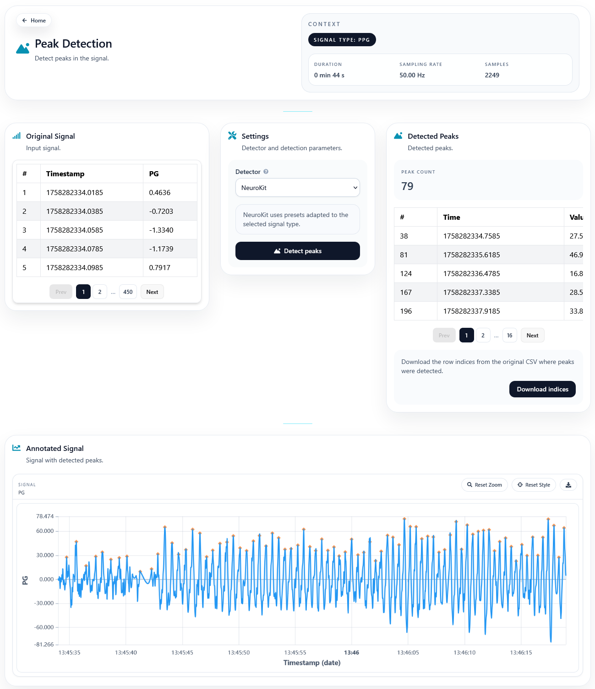

Peak Detection
==============

The Peak Detection page is used to identify relevant local maxima in the selected signal.

Overview
--------

After execution, the page presents both the annotated chart and a table containing the detected peaks.

Detection modes
---------------

The current interface provides two detector styles:

- **NeuroKit** for a more automatic signal-aware configuration
- **SciPy** for a more manual detector where the user can tune parameters such as minimum distance or height

Controls
--------

The settings card allows the user to configure:

- Detector type
- Minimum distance between peaks
- Minimum peak height when the SciPy path is used

Results
-------

After execution, the page provides:

- Peak count
- Paginated table of detected peaks
- Annotated signal chart
- Download of the original-row peak indices

This makes the page useful both for quick inspection and for exporting peak positions into a downstream workflow.

.. Screenshot: add a capture of the settings card and results after a successful run.
   Suggested file: ``docs/source/_static/peaks-results.png``.

