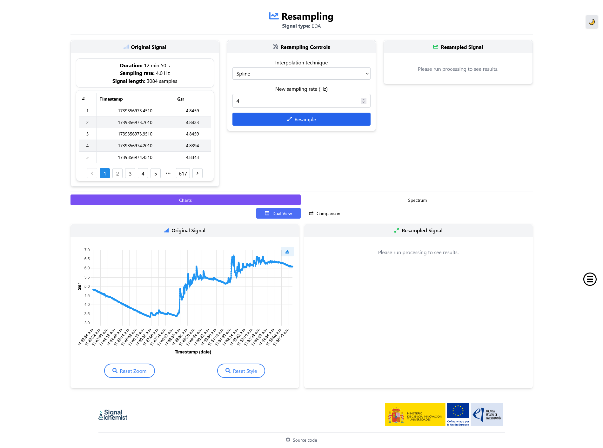
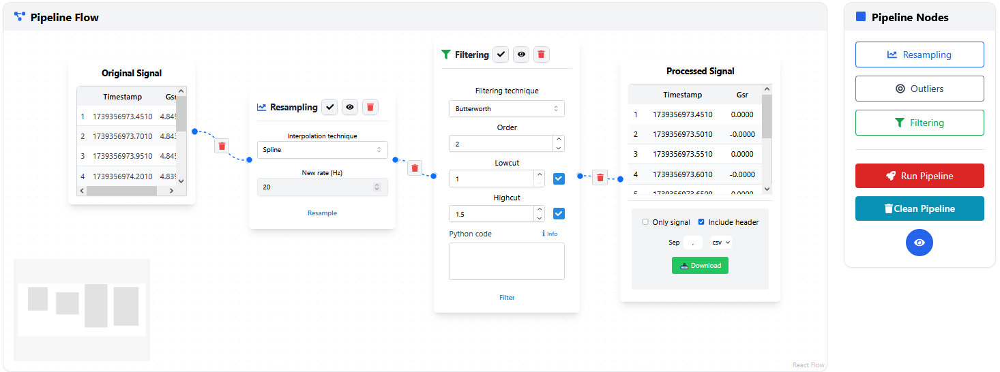

Processing
==========

The **processing** panel is the most powerful feature of SignAlchemist. It allows users to build and execute custom signal preprocessing pipelines using an interactive node-based interface.

Overview
--------

Inspired by tools like `KNIME <https://www.knime.com/>`_, the workflow editor lets users visually compose pipelines by connecting modular blocks (nodes). Each node corresponds to a preprocessing step, such as resampling, filtering, or outlier detection, and includes its own configurable parameters and controls.

This interface removes the need for coding while maintaining flexibility and transparency in signal processing.

Features
--------

- **Modular preprocessing steps**: 
  Each node encapsulates a specific function:
  
  - Resampling node
  - Filtering node
  - Outlier detection node
  - Input and Output signal nodes

- **Drag-and-drop node system**: 
  Users can add, position, and connect nodes freely within the panel.

- **Custom parameters**:
  Configure each node individually with signal-specific options.

- **Execution flow**:
  Once the pipeline is built, it can be executed from start to finish. Each node shows:

  - Execution status 
  - A preview of intermediate results
  - Downloadable outputs

- **Python integration**:
  The filtering node optionally accepts custom Python code for advanced users, as explained in :doc:`Filtering <filtering>`.

Applications examples
---------------------

- Beginners can build pipelines with predefined modules by simply connecting blocks —ideal for EDA or PPG signals.
- Advanced users can insert custom Python code for personalised filters.
- Researchers can visualise how each step affects the signal and export intermediate or final results.

Workflow example
----------------

1. Add a **Resampling** node (e.g., to 20 Hz). 
2. Connect it to the **Original Signal** node.
3. Connect to a **Filtering** node using a Butterworth filter. Select both the low cutoff (e.g., 1 Hz) and high cutoff (e.g., 1.5 Hz) frequencies to isolate the desired band of the signal (this helps preserve relevant physiological frequencies while removing slow drifts and high-frequency noise).
4. Optionally, add an **Outlier Detection** node.
5. Finish with an **Output Signal** node to visualise and export results.

Each connection defines the signal flow, and nodes can be inspected or reconfigured at any time.

.. note::
   The processing panel enables iterative experimentation. Users can modify nodes and rerun the pipeline as needed.
