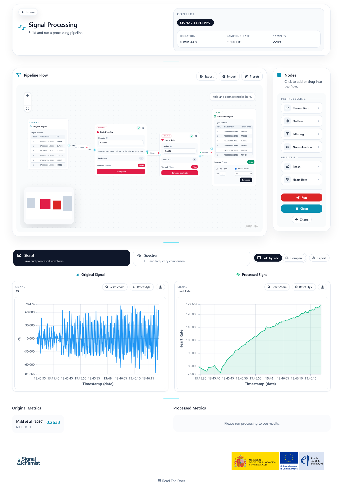
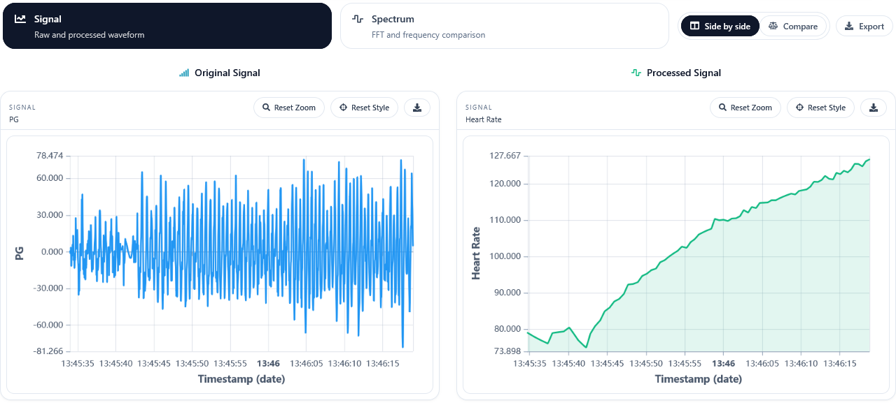

Processing
==========

The **Processing** panel is one of the most powerful parts of SignAlchemist. It allows users to build and execute signal preprocessing pipelines through a visual node-based interface.

Overview
--------

Inspired by tools such as `Orange <https://orangedatamining.com/>`_, `KNIME <https://www.knime.com/>`_, or `Node-RED <https://nodered.org/>`_, this workspace lets users connect modular processing blocks in order to define their own workflow.

Each node represents a concrete operation, such as resampling, filtering, normalisation, peak detection, or heart-rate estimation. In this way, the user can build a pipeline without writing code while still keeping the execution flow visible.

Main areas
----------

The page is organised into three main areas:

- **Pipeline Flow**: the central canvas where nodes are added and connected.
- **Nodes**: the side panel used to insert the available processing blocks.
- **Charts**: the lower area where original and processed results can be compared.

The signal loaded from the Home page remains available during the whole workflow.

Workflow editor
---------------

The canvas starts with an input and an output node. Additional processing steps can then be inserted between them.

Users can:

- Add nodes from the side panel
- Connect them to define the execution order
- Configure each node independently
- Import and export pipelines in JSON format
- Load predefined presets as a starting point

This makes it possible to design a reusable workflow and share it or execute it later in Batch.

.. Screenshot: add a full-page capture of Processing with a small valid pipeline loaded.
   Suggested file: ``docs/source/_static/processing-workspace-overview.png``.

Available nodes
---------------

The current workspace includes reusable blocks for:

- Resampling
- Filtering
- Outlier detection
- Normalisation
- Peak detection
- Heart-rate estimation

Each node includes its own configuration, execution state, and output preview.

Execution
---------

Once the workflow is built, the user can execute the pipeline from start to finish. The signal is propagated through the connected nodes in order, and each step can update the downstream result.

Depending on the selected nodes, the page can also display intermediate information such as peak counts, beat counts, or output previews.

Charts and comparison
---------------------

The lower section of the page provides the usual visual comparison tools, including signal and spectrum views.

When both original and processed data are available, the user can inspect them side by side or in comparison mode in order to see how each preprocessing step affects the signal.

.. Screenshot: add a capture of the chart area with a visible comparison.
   Suggested file: ``docs/source/_static/processing-comparison-area.png``.

