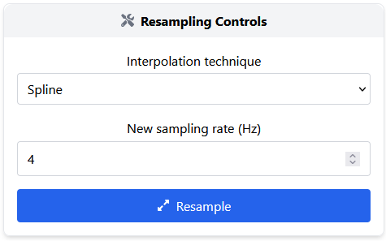

Resampling
==========

Resampling is often the first step in physiological signal preprocessing, especially when signals are acquired at inconsistent or low sampling rates. This is common with wearable devices, whose widespread use has led to signals being recorded at varying sampling rates and qualities. Resampling helps standardize these signals, enabling more reliable comparisons and calculations.

Overview
--------

The resampling module allows you to transform your raw signal to a new, consistent sampling rate using a variety of interpolation techniques.

This is useful to:

- Standardise input signals from different sources
- Improve time resolution
- Prepare data for machine learning or statistical analysis

Interpolation techniques
-------------------------

Users can choose between different interpolation methods:

- **Spline**:  
  smooth interpolation using B-spline curves. Good for physiological signals with smooth trends.

- **Interp1d**: 
  flexible 1D interpolation using SciPy. 

Interface controls
------------------

- **Interpolation technique**: select the desired method from the dropdown.
- **Parameters**: the input field correspond to the new rate in Hz (specify the target sampling rate for the signal).
- **Execute resampling**: applies the resampling technique and updates the results displayed in the interface.
- **Core widgets**: the results are displayed using core widgets, more specifically, charts and spectrum widgets. For more details, refer to the
  :doc:`Core Widgets <core_widgets>`.

Once configured, the interface:

- Shows execution status via icons
- Allows preview of the resampled signal
- Enables export of the processed data and visual charts

.. image:: _static/resampling_full_interface.png
   :alt: Filtering full interface.
   :width: 70%
   :align: center

Applications examples
---------------------

- Upsampling an EDA signal from 4 Hz to 20 Hz to enable better filter application.
- Resampling a PPG signal recorded with variable sampling to 100 Hz for standard analysis.
- Harmonising input signals with different sampling frequencies before model training.

