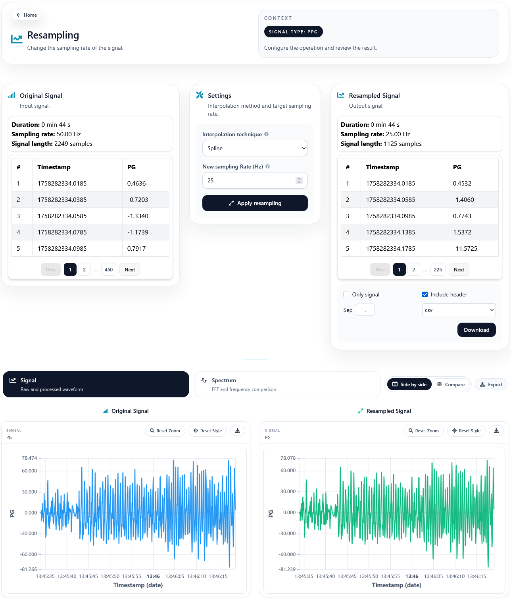

Resampling
==========

Resampling is often one of the first preprocessing steps in physiological signal analysis, especially when recordings come from devices with different or unstable sampling rates.

Overview
--------

The Resampling page allows the user to transform a signal to a new and consistent sampling rate using interpolation techniques.

This is useful to:

- Standardise signals from different sources
- Improve time resolution
- Prepare the data for later filtering or comparison

Interpolation techniques
------------------------

The current page provides two interpolation methods:

- **Spline**
- **Interp1d**

Both are configured from the same settings card.

Interface controls
------------------

- **Interpolation technique**: select the desired method from the dropdown.
- **New sampling rate (Hz)**: define the target rate.
- **Apply resampling**: execute the transformation and update the result area.
- **Core widgets**: the output is displayed using the shared charts and spectrum views described in :doc:`Core Widgets <core_widgets>`.

Once configured, the page:

- Shows the execution status
- Allows visual inspection of the resampled signal
- Preserves the original signal for comparison
- Supports the usual export tools from the chart area

.. Screenshot: add a capture of the resampling settings and result area after a successful run.
   Suggested file: ``docs/source/_static/resampling-page-result.png``.

Applications examples
---------------------

- Upsampling an EDA signal before filtering.
- Bringing recordings from different devices to the same frequency.
- Preparing a signal for a later processing step that assumes a stable rate.
