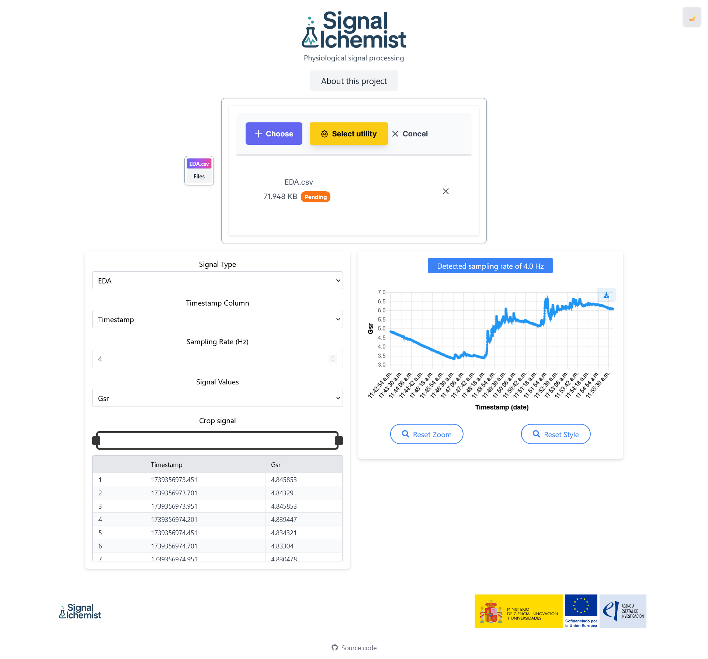

Usage
=====

Accessing the Application
----------------------------

After launching the containers, open your web browser and navigate to:

.. code-block:: none

   http://localhost:<FRONTEND_PORT>

Replace ``<FRONTEND_PORT>`` with the actual port number you set in your ``.env`` file.

For example, if your ``.env`` file contains:

.. code-block:: none

   FRONTEND_PORT=5173

You can access the app at:

.. code-block:: none

   http://localhost:5173

